

# 📱 ResumeHub

**Платформа для публикации резюме и поиска работы**

  <b>
    <a href="README.md">🇷🇺 Русский</a> | 
    <a href="README.en.md">🇬🇧 English</a>
  </b>

---

## ✨ О проекте

**ResumeHub** — это iOS-приложение, которое я разрабатываю для демонстрации навыков, необходимых Junior iOS-разработчику. Проект включает полный цикл аутентификации, работу с облачной базой данных и отправку email-уведомлений.

### Ключевые возможности

| | |
|---|---|
| 🔐 **Регистрация и вход** | Два метода: логин/пароль + одноразовый код на email |
| 🔄 **Восстановление пароля** | Автоматическая генерация нового пароля и отправка через SMTP |
| ☁️ **Хранение данных** | Пользователи и резюме в **Firebase Firestore** |
| ✉️ **Email-уведомления** | Собственный **SMTP-клиент** (без сторонних SDK) |
| 🎬 **Анимация** | Кастомный анимированный Launch Screen |
| 🌍 **Локализация** | Русский и английский интерфейс |
| 🌓 **Темы** | Полная поддержка светлой и тёмной темы |

---

## 🛠 Технологии

  
  
  
  
  
  
  
  

---

## 🎬 Анимация Launch Screen

| Светлая тема | Тёмная тема |
|:------------:|:-----------:|
| 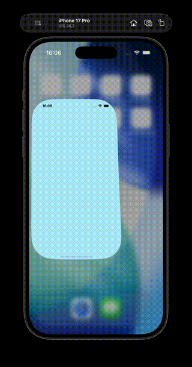 | 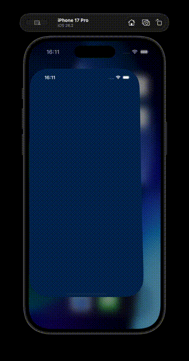 |

---

## 📱 Скриншоты

### 🔐 Экран авторизации по логину

| Светлая тема | Тёмная тема |
|:------------:|:-----------:|
| 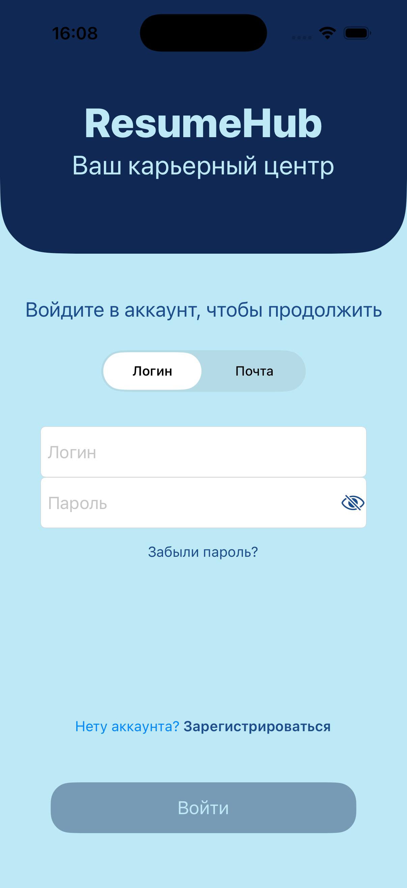 | 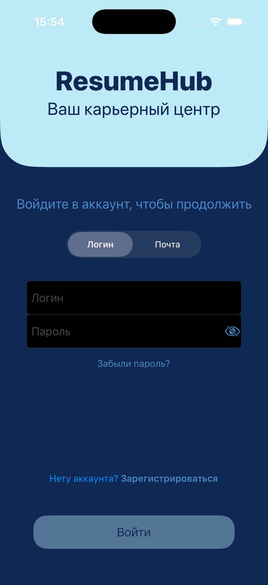 |

### 📧 Экран авторизации по почте

| Светлая тема | Тёмная тема |
|:------------:|:-----------:|
| 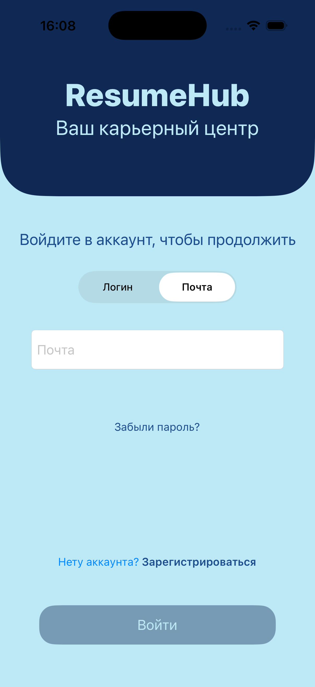 | 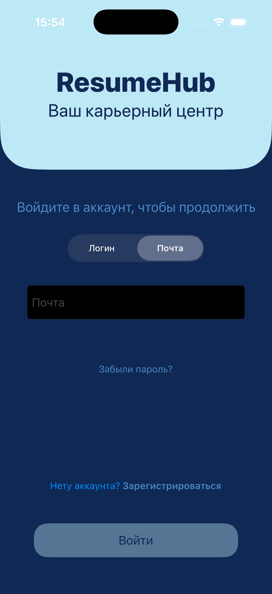 |

### 📝 Экран регистрации

| Светлая тема | Тёмная тема |
|:------------:|:-----------:|
| 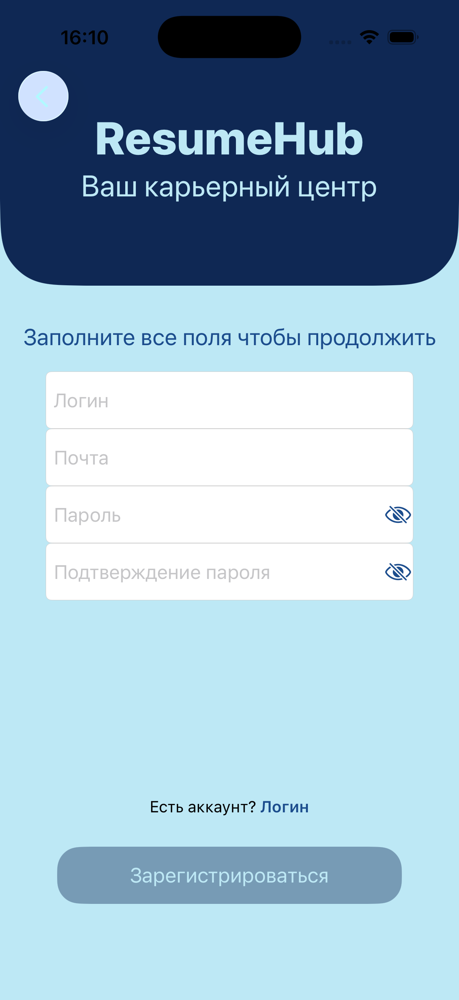 | 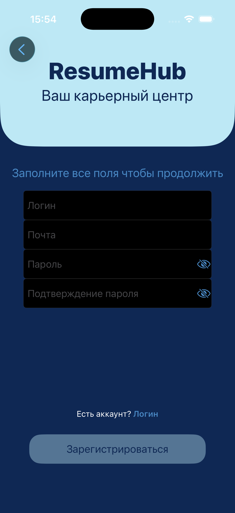 |

### ✉️ Форма ввода кода

| Светлая тема | Тёмная тема |
|:------------:|:-----------:|
| 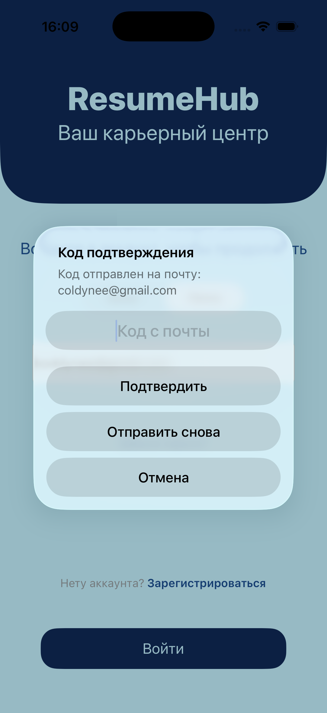 | 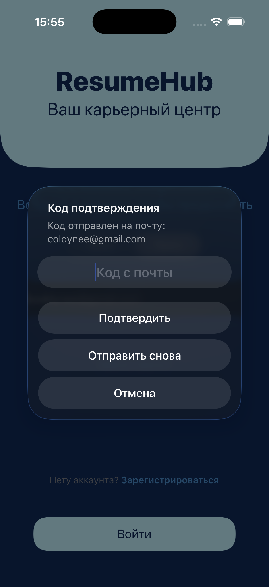 |

### 🔓 Форма восстановления пароля

| Светлая тема | Тёмная тема |
|:------------:|:-----------:|
| 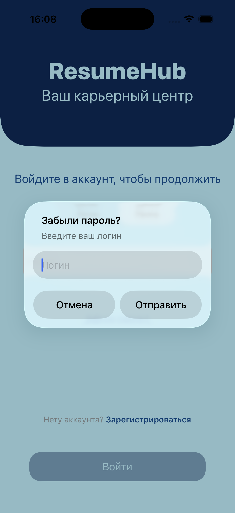 | 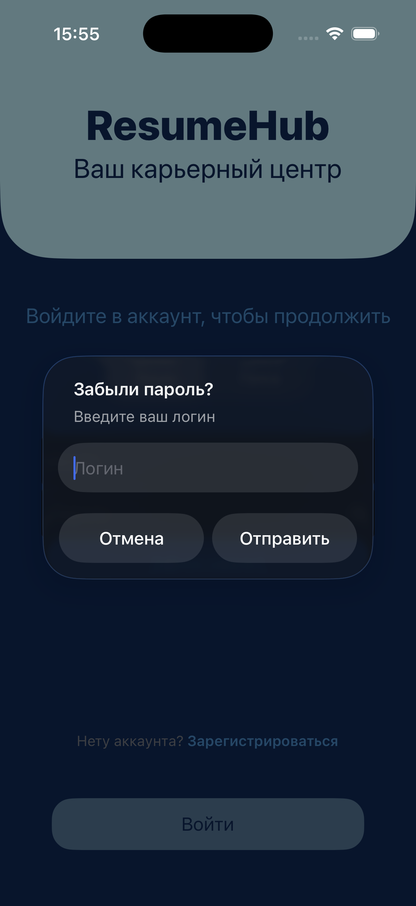 |

---

## 🧠 Архитектура

Проект построен на **MVVM + Coordinator**:

| Компонент | Роль |
|-----------|------|
| **View** | Только отображение (вёрстка кодом через SnapKit) |
| **ViewModel** | Бизнес-логика, валидация, вызовы сервисов |
| **Coordinator** | Вся навигация |
| **Combine** | Связывание View и ViewModel |

---

## 🚀 Планы по развитию

Проект активно развивается. В ближайшее время планирую:

### 🔹 Основные функции
- [ ] **Лента резюме** — просмотр и фильтрация опубликованных резюме
- [ ] **Редактирование профиля** — добавление аватара, информации о себе, контактов
- [ ] **Сохранение резюме в избранное** у соискателей и работодателей

### 🔹 Технические улучшения
- [ ] **Unit-тесты** — покрытие ключевых модулей (ViewModel, ValidationService)
- [ ] **Хеширование паролей** — использование `CryptoKit` для безопасного хранения
- [ ] **CI/CD** — настройка автоматической сборки и тестов через GitHub Actions

### 🔹 Дополнительно
- [ ] **Push-уведомления** — интеграция Firebase Cloud Messaging
- [ ] **Биометрия (FaceID/TouchID)** — быстрый вход в приложение
- [ ] **CocoaPods** — опробовать управление зависимостями на реальном проекте

---

## 🚀 Как запустить

1. Клонировать репозиторий  
   `git clone https://github.com/coldynee/ResumeHub.git`
2. Открыть `ResumeHub.xcodeproj`
3. Собрать и запустить (Cmd + R)

---

## 📫 Контакты

  
  
  

---

## 📄 Лицензия

Проект создан в учебных целях.
